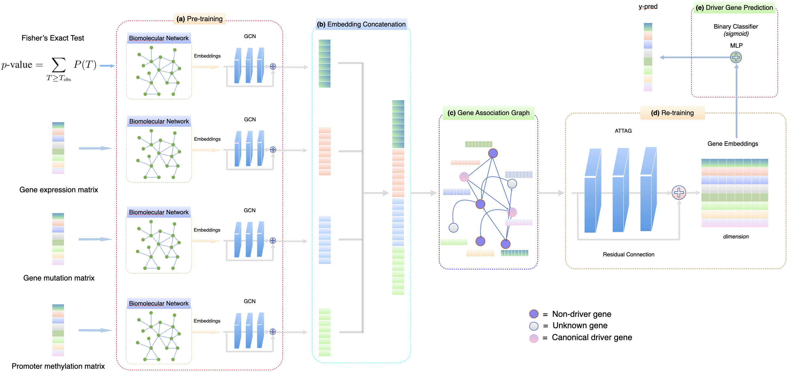

# ATTAG
## Integration of Multi-Omics Data with Topology Adaptive Graph Convolutional Network for Cancer Driver Gene Identification

This repository contains the code for our project,  
**"Integration of Multi-Omics Data with Topology Adaptive Graph Convolutional Network for Cancer Driver Gene Identification,"**  
submitted to the **IEEE Transactions on Computational Biology and Bioinformatic**,  
on **January 27, 2025**.  

## Data Source

The dataset is obtained from the following sources:

- **[GGNet](https://rnasysu.com/encori/)**  
- **[PathNet](https://genomebiology.biomedcentral.com/articles/10.1186/gb-2010-11-5-r53?utm_source=chatgpt.com)**  
- **[PPNet](https://string-db.org/cgi/download?sessionId=b7WYyccF6G1p)**  

## Setup and Get Started

1. Install the required dependencies:
   - `pip install -r requirements.txt`

2. Activate your Conda environment:
   - `conda activate gnn`

3. Install PyTorch:
   - `conda install pytorch torchvision torchaudio -c pytorch`

4. Install the necessary Python packages:
   - `pip install pandas`
   - `pip install py2neo pandas matplotlib scikit-learn`
   - `pip install tqdm`
   - `pip install seaborn`

5. Install DGL:
   - `conda install -c dglteam dgl`

6. Download the data from the built gene association graph using the link below and place it in the `data/` directory before training:
   - [Download Gene Association Data](https://drive.google.com/file/d/1lDDL6cy8LljFoHUu7nYo3mR58SsdcuuH/view?usp=drive_link)

7. To train the model, run the following command:
   - `python attag/train.py --model_type ATTAG --net_type ppnet --score_threshold 0.99 --learning_rate 0.001 --num_epochs 300`
