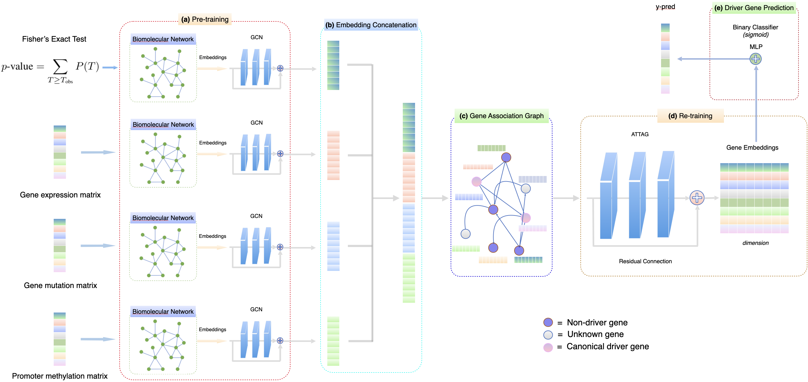

# ATTAG
## Integration of Multi-Omics Data with Topology Adaptive Graph Convolutional Network for Cancer Driver Gene Identification

This repository contains the implementation of our project, 
**"Integration of Multi-Omics Data with Topology-Adaptive Graph Convolutional Network for Cancer Driver Gene Identification,,"**  
submitted to the **IEEE Transactions on Computational Biology and Bioinformatics**,  
on **January 27, 2025**.  

Paper: https://www.computer.org/csdl/journal/bb/5555/01/11270241/2bZpFKAJyHS

🔗 DOI: https://doi.org/10.1109/TCBBIO.2025.3636976

🔗 PMID: https://pubmed.ncbi.nlm.nih.gov/41308109/
Available at: https://ieeexplore.ieee.org/stamp/stamp.jsp?arnumber=11270241

## Data Source

The dataset is obtained from the following sources:

- **[GGNet](https://rnasysu.com/encori/)**  
- **[PathNet](https://genomebiology.biomedcentral.com/articles/10.1186/gb-2010-11-5-r53?utm_source=chatgpt.com)**  
- **[PPNet](https://string-db.org/cgi/download?sessionId=b7WYyccF6G1p)**  

## Setup and Get Started

1. Install the required dependencies:
   - `pip install -r requirements.txt`

2. Activate your Conda environment:
   - `conda activate gnn`

3. Install PyTorch:
   - `conda install pytorch torchvision torchaudio -c pytorch`

4. Install the necessary Python packages:
   - `pip install pandas`
   - `pip install py2neo pandas matplotlib scikit-learn`
   - `pip install tqdm`
   - `pip install seaborn`

5. Install DGL:
   - `conda install -c dglteam dgl`

6. Download the data from the built gene association graph using the link below and place it in the `data/` directory before training:
   - [Download Gene Association Data](https://drive.google.com/file/d/1lDDL6cy8LljFoHUu7nYo3mR58SsdcuuH/view?usp=drive_link)

7. For pretraining, run the following command: 
   ATTAG % python embedding/tag_embedding.py \
      --model_type GraphSAGE \
      --in_feats 256 --out_feats 256 \
      --num_layers 2 \
      --lr 0.0001 \
      --num_epochs 5
      
8. For prediction, run the following command:
   - `python attag/train.py --model_type ATTAG --net_type ppnet --score_threshold 0.99 --learning_rate 0.001 --num_epochs 300`

<h2>Citation</h2>

If you find this project useful for your research, please cite it using the following BibTeX entry:

<pre><code>@article{LiTCBB2025TopoGNN,
  author  = {Li, Sa and Shader, Jonah and Bhattacharya, Anirban and Ma, Tianle},
  title   = {Integration of Multi-Omics Data with Topology Adaptive Graph Convolutional Network for Cancer Driver Gene Identification},
  journal = {IEEE Transactions on Computational Biology and Bioinformatics},
  year    = {2025},
  month   = nov,
  pages   = {PP},
  doi     = {10.1109/TCBBIO.2025.3636976},
  url     = {https://ieeexplore.ieee.org/document/3636976},
  note    = {Epub ahead of print. PMID: 41308109}
}
</code></pre>
